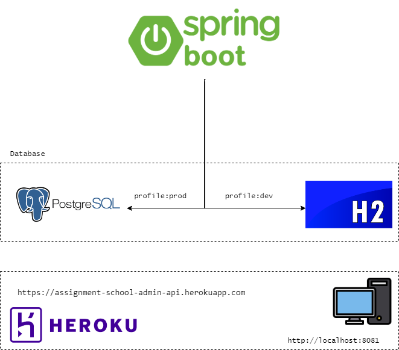
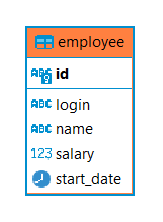

# Assignment for technical assessment [(Requirement)](./src/main/resources/Instructions.pdf)

### Introduction
The Employee Salary Management Web Service is a MVP application designed to help HR departments manage and analyze employees' salaries. This service maintains an employee list that includes unique alphanumeric IDs assigned by the company, unique alphanumeric logins assigned by the company, and non-unique possibly non-English names.

### Features
The Employee Salary Management Web Service provides the following features:

- Add a new employee
- Update an employee's information
- Find employees by ID and/or login (exact match)
- Delete an employee (restricted permission)
- Analyze employee salaries (average, minimum, maximum)

### Technology Stack
The Bookstore API is built using the following technology stack:

- Java 11
- Spring Boot Framework
- Maven
- H2 Database (for local development environment)
- PostgreSQL (for production environment)

The Spring Boot Framework provides a robust and scalable platform for building web applications. H2 Database is used for local development, providing an in-memory database for quick and easy testing. For production, the project is configured to use PostgreSQL, a powerful and reliable relational database management system.

By utilizing these technologies, the project is able to deliver a fast, reliable, and secure web application for managing assignments and students.

### Architecture diagram illustration

### DB diagram illustration

### Hostname

- dev profile: `http://localhost:8082`  
- prod profile: `https://employee-salary-management-api.herokuapp.com/`  

### Software requirements

1. Java 11
2. Maven
3. Git

### Preloaded data

There is no pre-loaded data so you have to manually add data or import data from file. [HERE](./src/main/resources/employee.csv) is the pre-loaded data file where you can import using postman collection [HERE](./src/main/resources/employee-salary-management-assignment.postman_collection.json)

### How to Run

To run the Bookstore API, follow these steps:

- Make sure you have fulfilled the above software requirements.

- Clone this repository to your local machine by running the below command in terminal:

      git clone https://github.com/norulshahlam/employee-salary-management-assignment.git

- Navigate to the project directory in the terminal/command prompt.

- Build the app by running the following command:

       mvn clean install package

- The build application will be stored in /target folder. Now run the following command to run the app:  

       java -jar target/employee-salary-management-assignment-0.0.1-SNAPSHOT.jar

- Now your application has started. By default, dev profile is selected and there is no preloaded data as mentioned above.

- You can test the API using swagger by opening any browser and use the following url:

      {hostname}/swagger-ui/index.html#/

- Alternatively, you can use postman to manually test the endpoints. Download the postman  collection [**HERE**](./src/main/resources/employee-salary-management-assignment.postman_collection.json), and use Postman to import this collection. Now you can test the endpoints using Postman. Make sure you have postman installed. You can click [**HERE**](https://www.postman.com/downloads/) to download if you dont't have one.

- You may skip all steps above if the production hostname is available, to access Swagger.

      {hostname}/swagger-ui/index.html#/

- For any issues, email me at norulshahlam@gmail.com or whatsapp me at +6592212152

### Conclusion

Congratulations, you have successfully compiled and run the app!

***************************************

Solution was the H2 version. We upgraded also H2 to 2.0 but that version is not compatible with Spring Batch 4.3.4. Downgrade to H2 version 1.4.200 solved the issue.

Uses jpa specifications sources:
https://stackoverflow.com/questions/71365002/spring-jpa-join-and-orderby-in-specification
criteria builder
https://docs.oracle.com/cd/E19226-01/820-7627/gjitv/index.html
https://en.wikibooks.org/wiki/Java_Persistence/Criteria